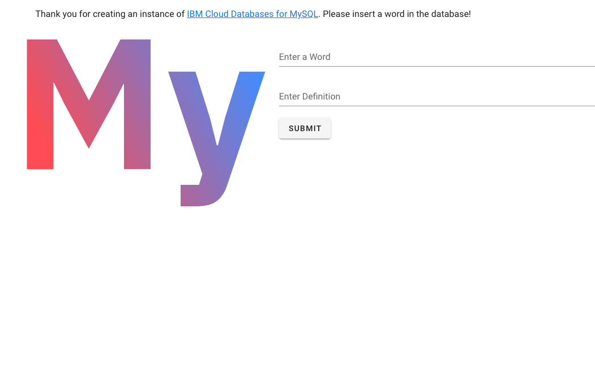
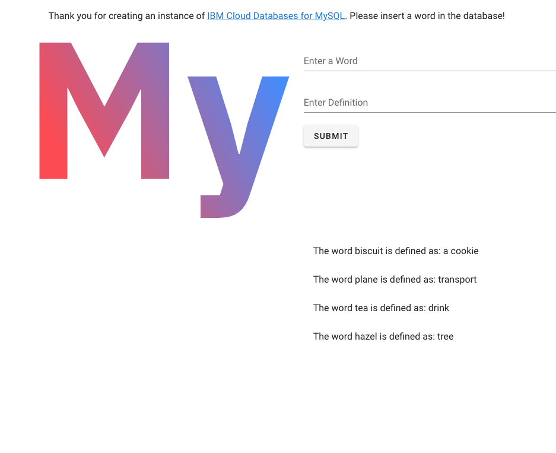

<<<<<<< HEAD
# IBM Cloud Databases and Messages Examples

A set of example applications built on IBM Cloud with Cloud Foundry using IBM Cloud Databases and Messages to store and retrieve data.

The repositories containing samples for each database and message queue. Each git branch of this repository corresponds to samples in a particular programming language. For example, when you click on **Branch** you will see there is a **node** branch, where all examples are written in JavaScript using Node.js. Once you've clicked on the branch, files will be presented that correspond to either a database or a message queue.  

## Trying out the sample applications

Clone the repository of the language that you want to use. For instance, you can clone the **node** repository by clicking on the **node** branch. Then select the green button **Clone or download** to get the URL you'll need to clone using SSH or HTTPS. In your terminal you can run a command like:

```shell
git clone -b node git@github.com:IBM-Cloud/clouddatabases-helloworld-cloudfoundry-examples.git
```

Once the branch has been cloned you can select the appropriate directory for the database you want to try out. Each database has its own instructons on how to provision and deploy a database or message queue and an application on IBM Cloud with Cloud Foundry.
=======
# IBM Cloud Databases and Messages Node Examples

A set of example NodeJS applications that will add word/definition pairs to a database or message queue running on IBM Cloud.

## Running the examples

### Pre-requisites

1. An IBM Cloud account. If you do not already have one, [sign up here](https://cloud.ibm.com/registration)
2. [Nodejs and npm](https://docs.npmjs.com/downloading-and-installing-node-js-and-npm)
3. [Terraform](https://www.terraform.io/downloads.html)
4. [Docker](https://docs.docker.com/get-docker/) (optional, if you want to run the application from a Docker container)


### Step 1: Obtain an API key to deploy infrastructure to your account

Follow the steps in [this document](https://cloud.ibm.com/docs/account?topic=account-userapikey&interface=ui#create_user_key) to create an API key and make a note of it.

### Step 2: Clone the project 
```
git clone https://github.com/IBM-Cloud/clouddatabases-helloworld-examples.git
```

### Step 3: Install the infrastructure

Go into the `terraform` folder in the <directory> of the database example you want to run (e.g. mysql).

Create a document called `terraform.tfvars` with the following fields: 
```
ibmcloud_api_key = "<your_api_key_from_step_1>"
region = "eu-gb"
admin_password  = "<make_up_a_password>"
```

The `terraform.tfvars` document contains variables that you may want to keep secret so it is ignored by the GitHub repository.

Now install the infrastructure by typing:

```
terraform init 
terraform apply --auto-approve
```

The Terraform script will output some configuration data that will be needed to run the application, so copy it into the root folder:

```
terraform output -json >../config.json
```

### Step 4: Run the app locally

The easiest first step is to run the application that will connect to the database from your local machine. To do this make sure you are in the <folder> of the database you want to run (e.g. mysql), then install the node dependencies and run the service:

```
npm install
npm run start
#Connected!
#Server is listening on port 8080
```

Open a browser and visit http://localhost:8080

You should see a welcome page with a database logo, e.g. 




You can then enter a word and its definition. The data pair will get added to the database and will appear in a list at the bottom of the page:




<br>

### Step 5 (Optional): Run the app from a Docker container

You can also put the app code inside a Docker container and run it from there. This would be a first step towards hosting your application from a service like [Code Engine](https://www.ibm.com/cloud/code-engine).

Make sure you are logged into your Docker account. In the <directory> of the database example you are using type:

```
docker build -t database-hello-world:1.0 . 
docker run -p 8080:8080 database-hello-world:1.0
```

You should now be able to visit  http://localhost:8080 and see the same web page you saw in the previous step
>>>>>>> node
